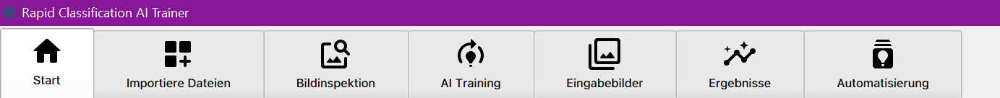

# RCAIT 

Rapid Classification AI Trainer

## Welcome to RCAIT!

This is the repository for the  _Rapid Classification AI Trainer Project_ (PSE SS 2021)   developed for
_Fraunhofer IOSB_.

### Description

In order to train Deep learning based models, a lot of training data is required. Collecting and annotating this
training data can take a lot of time and resources. The goal of the **Rapid-Classification AI Trainer** PSE project is a
desktop application that uses various search terms to load images from the Internet and starts training a deep learning
model with them. Using the search terms, the images already have a class assignment and no longer need to be annotated.
A central requirement of the project is a high degree of modularity. Both the loading of the images and the AI training
are to be implemented via plug-ins, so that new data sources and new training methods can be added later.

The implementation will take place in **C⁺⁺** and **Qt**. **Git** is used for code management.

## Getting Started

The program's tab structure guides you through the process. Not all steps have to be taken. The main steps are:

* Create and/or select a project.
* Create and/or select a model.
* Download additional images with a plugin of your choice.
* Inspect the images.
* Start a training.
* Classify some images.
* Check training and classification results.

## Fullfilled Criteria

### Required Criteria

- [x] Create and/or select a project.
- [x] Delete an existing project.
- [x] Add a pre-trained model.
- [x] Add a user-defined model.
- [x] Delete an existing model.
- [x] Import additional images using keywords/labels.
- [x] Load keywords/labels from the .txt file.
- [x] Load some images for training and/or validation.
- [x] Inspect the images.
- [x] Configurate and execute a data augmentation.
- [x] Start a training.
- [x] Check and save training results.
- [x] Load some images for classification.
- [x] Classify the images.
- [x] Check and save classification results.
- [x] See and analyse automatically generated: 
  - confusion matrix
  - loss curve
  - 10 the most misclassified images
  - top 1 and top 5 accuracy
- [x] Add new plugin(s).
- [x] Set and/or select a Classification plugin.
- [x] Set and/or select an Imageloader plugin.

### Optional Criteria

- [x] Select the interface language (English, German or Russian).
- [x] Check data augmentation preview.
- [x] Compare configuration files of two models.
- [x] Compare 2 (or more) results.
- [x] Save the vector graphics images for all results.
- [x] Support more crawler plugins for several popular search engines.
- [x] Separate validation and training data set.
- [ ] Detect objects using MMDDetection. 
- [ ] Log to prevent overuse of the API key.
- [ ] Integrated storage management of data sets.

## Included plugins

### Disclaimer

This program lets you download lots of images from Google, Bing and other search engines. By using it, you agree to
respect any intellectual or copyright related property rights.

Search indexes merely index images and allow you to find them. They do NOT produce their own images and, as such, they
don't own copyright on any of them. The original creators of the images own the copyrights.

**Use this program only for educational purposes.**

### Flickr Plugin

Uses the [Flickr API](https://www.flickr.com/services/api/) through the [flickrapi](https://pypi.org/project/flickrapi/)
python library. API key and secret can be obtained from Flickr by following the steps outlined in their API guide.

Can be obtained by running `pip install flickrapi`

### Bing Plugin

Download images from the Microsoft Bing search engine with
the [bing-image-downloader](https://github.com/gurugaurav/bing_image_downloader) library.

Can be obtained by running `pip install bing-image-downloader`

### Folder Plugin

Load images from a specified folder into the project. Folders are specified in the settings.

### Google Plugin

Download images from the Google search engine with
the [Google-Images-Search](https://pypi.org/project/Google-Images-Search/) python library. Follow instructions there to
register a custom search engine. Runs under Linux because it's dependent on curses libary (
see [this](https://stackoverflow.com/questions/35850362/importerror-no-module-named-curses-when-trying-to-import-blessings))

### [MMClassification Plugin](https://github.com/open-mmlab/mmclassification)

## Rare Cases & Fixes

### QSettings Crash

It might (very rarely but still) happen, that the QSettings Registry object is corrupted during writing/reading from the
system. If that happens, the program will not start any more and the debugger will only show `SIG_SEGFAULT at 0x0000000`
This is not a fault of our code and there is nothing we can do to fix it, because it happens before our program is even
loaded.

#### Workarounds:

- Under Linux, delete the file `/home/ies/<username>/.config/PSE2021/RCAIT.conf`
- Under Windows, delete the registry entry `Computer\HKEY_CURRENT_USER\Software\PSE_SS21\RCAIT`
- Restart the application then.

## License

RCAIT is released under the **LGPLv3** [License](LICENSE)

_( GNU LESSER GENERAL PUBLIC LICENSE_ Version 3 _)_

